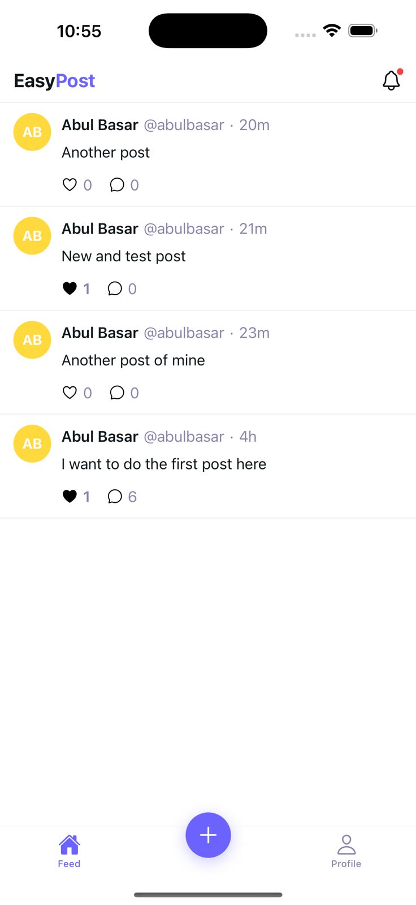
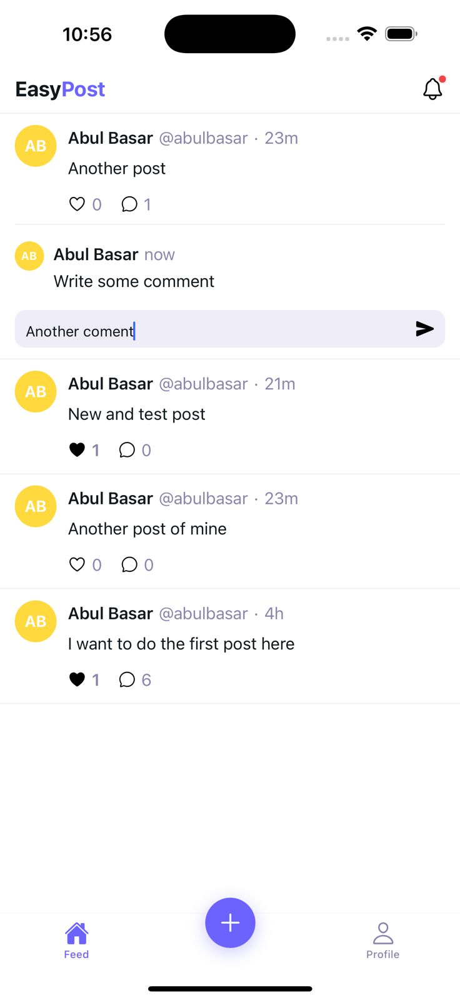
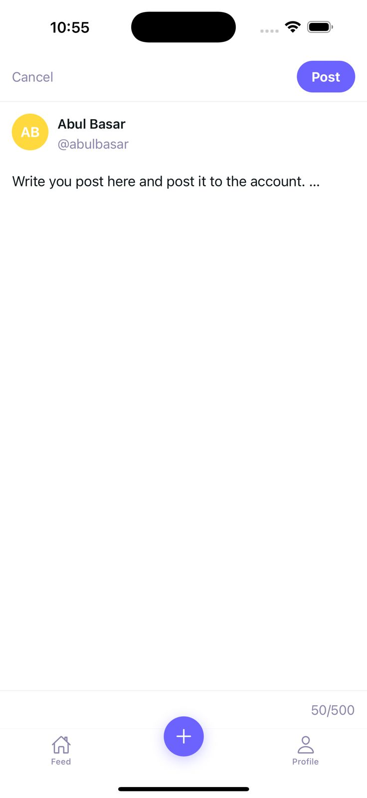
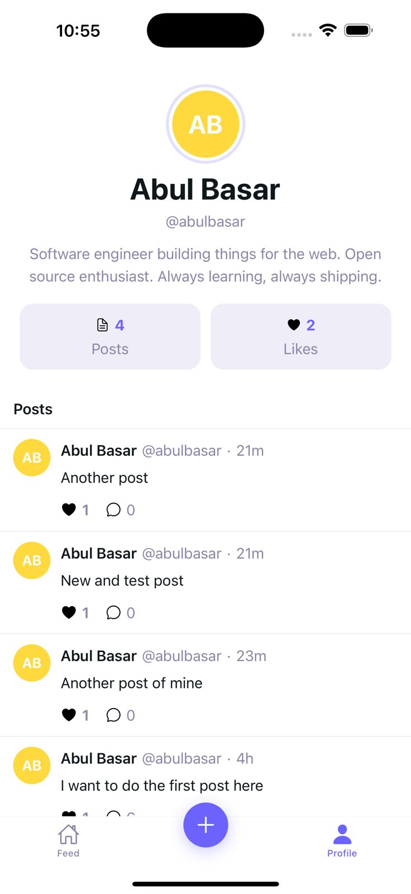
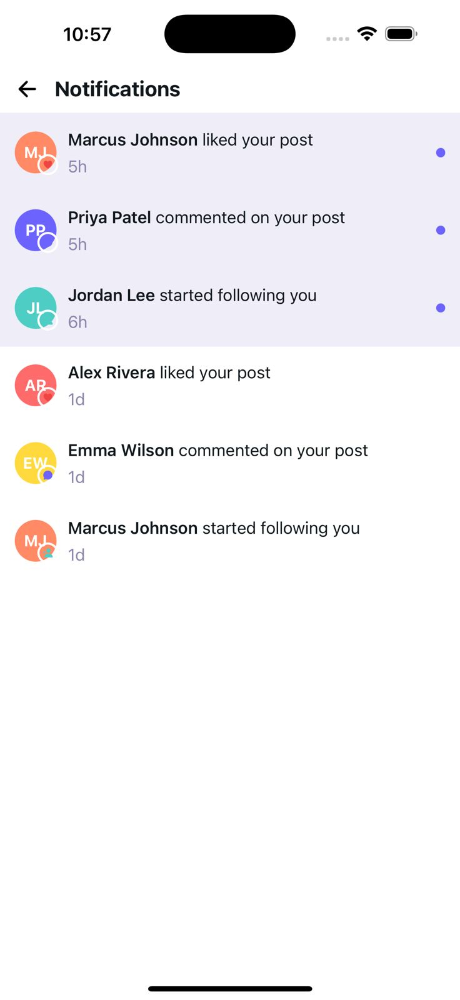

# EasyPost - Mini Social Feed App

EasyPost is a lightweight social media application built with React Native and Expo. It allows users to post updates, view a shared feed, interact with posts through likes and comments, and receive real-time notifications.

## Screenshots

### Main Screens

| Home Feed                                 | Home Feed with Comments                                    | Create Post                                 | Profile                                    |
| ----------------------------------------- | ---------------------------------------------------------- | ------------------------------------------- | ------------------------------------------ |
|  |  |  |  |

### Notifications

| Notifications                                               |
| ----------------------------------------------------------- |
|  |

## Installation

### Prerequisites

- Node.js (v18 or later)
- npm or yarn
- Expo CLI
- iOS Simulator (for iOS development) or Android Studio (for Android development)

### Steps

1. Clone the repository:

   ```bash
   git clone <repository-url>
   cd easypost
   ```

2. Install dependencies:

   ```bash
   npm install
   ```

3. Set up Firebase:
   - Create a Firebase project at [Firebase Console](https://console.firebase.google.com/)
   - Enable Authentication, Firestore Database, and Cloud Messaging
   - Add your Firebase configuration to the app

4. Start the development server:

   ```bash
   npm start
   ```

5. Run on your preferred platform:
   - For iOS: `npm run ios`
   - For Android: `npm run android`
   - For Web: `npm run web`

## Features

- User Authentication: Login and signup screens
- Social Feed: Scrollable list of posts with like and comment functionality
- Post Creation: Text-only form to publish new posts
- Interactions: Like and comment on posts
- Filtering: Filter newsfeed by username
- Real-time Notifications: Push notifications via Firebase for new likes and comments

## Tech Stack

- Frontend: React Native with Expo
- Navigation: Expo Router
- Styling: NativeWind (Tailwind CSS for React Native)
- Backend: Firebase (for authentication, database, and notifications)
- Language: TypeScript

## Usage

### Screens

- Login/Signup: Authenticate users
- Feed: View all posts, like, comment, and filter by username
- Create Post: Compose and publish new text posts
- Notifications: View push notifications for interactions

### Key Interactions

- Tap the heart icon to like a post
- Tap the comment icon to add a comment
- Use the filter to view posts from specific users
- Receive real-time notifications for new likes and comments

## Project Structure

```
easypost/
├── app/                    # Expo Router app directory
│   ├── _layout.tsx        # Root layout
│   ├── modal.tsx          # Modal screens
│   └── (tabs)/            # Tab-based navigation
│       ├── _layout.tsx
│       ├── index.tsx      # Home/Feed screen
│       └── explore.tsx    # Explore screen
├── components/            # Reusable components
├── constants/             # App constants and theme
├── hooks/                 # Custom React hooks
├── assets/                # Images and other assets
└── scripts/               # Utility scripts
```

## Development

- `npm start`: Start the Expo development server
- `npm run reset-project`: Reset the project to its initial state
- `npm run lint`: Run ESLint for code quality checks

## Contributing

1. Fork the repository
2. Create a feature branch
3. Make your changes
4. Run tests and linting
5. Submit a pull request

## License

This project is licensed under the MIT License.
